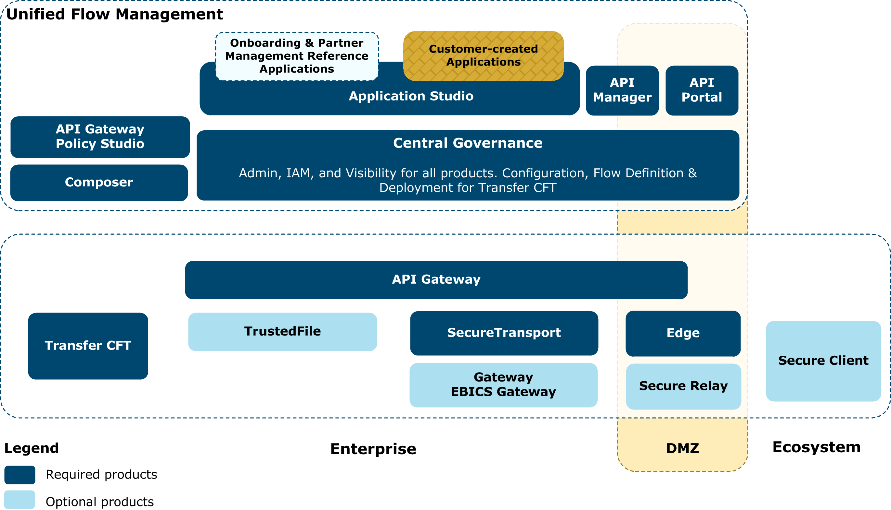

{
    "title": "Axway AMPLIFY architecture",
    "linkTitle": "Axway AMPLIFY architecture",
    "weight": "120"
}Axway AMPLIFY Managed File Transfer provides a product platform aimed at increasing the
efficiency of business processes. This platform enables you to integrate
the applications in your corporate information system and implement exchanges
between these applications and external partners. Transfer CFT in combination with other Axway products can provide a complete business solution for creating secured, guaranteed
exchanges with partners.

## Axway products

Transfer CFT can interact with a variety of Axway products
 to enable
you to better supervise, track, and analyze your transfer operations.
Additional products include, but are not limited to, the following:

-   [API portal](#apiportal), [API Gateway](#apigtw), [API Manager](#apimanager)
-   [Central Governance](#central_governance)
-   Communication gateways: [Gateway, Secure Transport](#gateway)
-   [SecureRelay](#securerelay)
-   [TrustedFile](#trustedfile)

Example Axway AMPLIFY MFT implementation



#### API Gateway

API Gateway is a comprehensive platform for managing, delivering, and securing enterprise APIs, applications, and consumers. In this reference solution, it can be used to manage web services and APIs exposed by Transfer CFT, SecureTransport, or third-party products.

#### API Manager

API Manager provides web-based API administration and partner management capabilities layered on API Gateway, as well as an API Catalog with life cycle management. The web UI also enables an administrator to manage partners that consume APIs and set the appropriate levels of security and quotas.

#### API Portal

API Portal is a self-service portal that enables client application developers to browse and consume APIs for use in their applications, whether they be mobile, social media, web, or traditional applications. API Portal enables engagement with both internal and external application developers to promote APIs for consumption. It enables new go to market channels in the digital economy.

#### Central Governance

For all products, Central Governance provides IAM and Visibility services through embedded editions of PassPort and Sentinel, enabling:

-   Global management of user identity and rights, providing a central control point for security enforcement
-   End-to-end centralized supervision of data flows, consistent with definitions in the repository
-   Out-of-the-box web dashboards to get a global view of data flow activity, as well as the ability to create custom dashboards

#### Central Governance for Transfer CFT

For Transfer CFT, Central Governance also provides product configuration, and flow definition and deployment services.

-   Global data flow repository, providing end-to-end data flow definitions, from business application to infrastructure level
-   Automatic discovery of products to be managed
-   Centralized management of product configuration and associated deployment, including mass processing capabilities for highly distributed environments, which include groups and configuration policies
-   Centralized day-to-day operations management: to start and stop products and to view their logs
-   Out-of-the box alert management to track any problem linked to products or data flow processing, including a subscription mechanism for alert notifications

#### Communication gateways

##### Gateway

Gateway is a secure, open and scalable communication gateway for mission-critical system-to-system data transfers with strong support for FSI protocols such as SWIFT. It handles
file exchanges between applications inside the enterprise, and partners
outside of the enterprise network.

##### SecureTransport

SecureTransport is an enhanced, secure, scalable, and highly available gateway for both system-to system data transfers and ad hoc human transactions. In Managed File Transfer, SecureTransport serves as a hub to secure and route file transfers between partners, internal applications, and humans.

##### SecureTransport Edge

Using SecureTransport Edge, you can create a multi-tier file exchange infrastructure with multi-protocol managed file transfer, SSL termination, and back-end authorization that streams data across the DMZ to SecureTransport.

You can deploy multiple Edge gateways in the DMZ for load balancing and performance optimization.

SecureTransport Edge also safeguards compliance wit HSOX, GLBA, HIPAA, and other corporate, industry, and government mandates governing the security and privacy of sensitive information.

#### SecureRelay

Secure Relay is a secure edge gateway that integrates with Axway Interchange and Gateway. You deploy Secure Relay in the DMZ to protect your data, your customers and your networks while enabling critical file transfer services between approved parties.

#### TrustedFile

TrustedFile provides cryptographic features for encryption and digital signature, and is used to secure data at rest. TrustedFile is a standalone product, but is also embedded in Transfer CFT.
