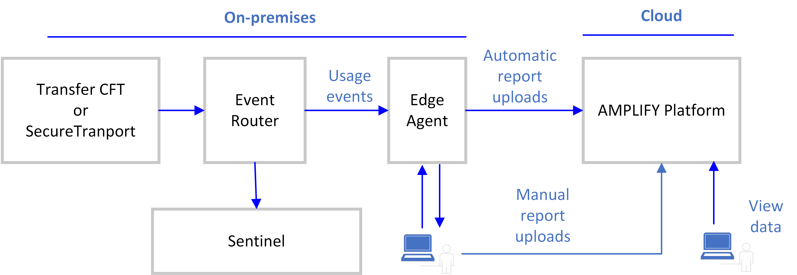

{
    "title": "Implement the Edge Agent",
    "linkTitle": "Implement the Edge Agent",
    "weight": "210"
}This page describes how to configure the Edge Agent for AMPLIFY MFT implementations and configure Transfer CFT for the following use cases:

-   Usage tracking only
-   Usage tracking and Sentinel monitoring

Usage tracking only



Usage tracking and Sentinel monitoring



Report contents are computed once daily and reflect the completed transfers from the preceding day. Depending on your start and end dates, which must be at the very least the previous day, the report will contain the completed transfers for that time period.

For more information on reporting usage, Edge Agent setup and architecture, and other usage tracking details, please refer to the [AMPLIFY Usage Metering and Reporting Guide](https://docs.axway.com/bundle/subusage_en).

## Configure the Edge Agent

Perform the following steps on the Edge Agent for MFT implementations that use Transfer CFT or SecureTransport.

1.  Download the `AMPLIFY_Edge_Agent_MFT_<version>_configuration_<BNxxx>.zip `package from the [Axway Support Site](https://support.axway.com/).
2.  Extract the zip locally.
3.  Upload the MFT-usage.json file from the package to the &lt;Edge\_Agent\_install\_dir>/aggregator/usage\_tracking/`conf/agent/aggregation` directory.
4.  Upload the `MFT.json` file from the package to the &lt;Edge\_Agent\_install\_dir>/conf/agent/report directory.
5.  Restart the Edge Agent. Refer to the [AMPLIFY Usage Metering and Reporting Guide](https://docs.axway.com/bundle/subusage_en).

<table cellpadding="0" cellspacing="0">
   <col/>
   <col/>
   <col/>
      <tr>
         <td valign="top">         </td>
         <td valign="top"><b>Note</b>
         </td>
         <td data-mc-autonum="&lt;b&gt;Note&lt;/b&gt;" valign="top">The MFT.json file name is the configurationName that you use when querying the Edge Agent.         </td>
      </tr>
</table>

## Configure Transfer CFT

There are two methods of configuration depending on the use case you implement.

### Usage tracking only

In this use case, Transfer CFT sends the usage report directly to the Edge Agent.

Set the following uconf parameters to the Edge Agent values:

-   sentinel.trkipaddr: Edge Agent IP address
-   sentinel.trkipport: 8002 (by default, the non-SSL port for the Edge Agent)
-   sentinel.xfb.use\_ssl: No

### Usage tracking with the Edge Agent and monitoring with Sentinel

In this use case, Transfer CFT uses the Event Router to send notifications to both Sentinel and the Edge Agent.

You require an installed Sentinel and Event Router to implement this method. You may want to also refer to the [Sentinel Installation Guide](https://docs.axway.com/bundle/Sentinel_420_InstallationGuide_allOS_en_HTML5/page/Content/AxwayStartPage.htm).

#### On Transfer CFT 

Set the following uconf parameters to the Edge Agent values:

-   sentinel.trkipaddr: Event Router IP address
-   sentinel.trkipport: Event Router listening port

#### On the Sentinel server

1.  On Sentinel, copy the XFBCFTInfo and XFBTransfer Tracked Object files from the` <Transfer_CFT_install_dir>/home/extra/sentinel` to &lt;Sentinel\_install\_dir>/broadcast/commit/trackingobject folder.   
    If the Tracked Objects folder does not exist, you must create it.
2.  Restart Sentinel.

#### On the Event Router

When you are using the Event Router to send both usage tracking to the Edge Agent and monitoring to Sentinel, you must customize the Event Router. In the following configuration steps, XFBTransfer and `CycleLink `are sent to both the Edge Agent and Sentinel. However, XFBCFTInfo and `STXFBINFO `are only sent to the Edge Agent.

<table cellpadding="0" cellspacing="0">
   <col/>
   <col/>
   <col/>
      <tr>
         <td valign="top">         </td>
         <td valign="top"><b>Note</b>
         </td>
         <td data-mc-autonum="&lt;b&gt;Note&lt;/b&gt;" valign="top">The default target  is called SENTINEL in the steps below.         </td>
      </tr>
</table>

1.  Access the &lt;install\_dir>/SentinelEventRouter/conf directory.
2.  Edit the target.xml file to route the usage information to Sentinel and the Edge Agent (EDGEAGENT).
    1.  Add the Edge Agent as a new target.

    2.  <table cellspacing="0">   <col/>   <tbody>      <tr>         <td>               <li>&lt;Target name="EDGEAGENT"  defaultXntf="no"  defaultXml="no"&gt;
               </li>               <li>      &lt;Access mode="QLT"  addr="&lt;Edge_Agent_IP_address&gt;"  port="8002" /&gt;
               </li>               <li>    &lt;/Target&gt;
               </li>         </td>      </tr>   </tbody></table>

    3.  Define a route to send the `XFBTransfer `Tracked Object to the Edge Agent.

    4.  <table cellspacing="0">   <col/>   <tbody>      <tr>         <td>               <li>&lt;Route object="XFBTransfer" default_Notify="NotifyIf"&gt;
               </li>               <li>&lt;Condition notify="NotifyIf" target="EDGEAGENT" if="
[PRODUCTIPADDR] NOT _"/&gt;
               </li>               <li>&lt;/Route&gt;
               </li>         </td>      </tr>   </tbody></table>

    5.  Define a route to send the `CYCLELINK `to the Edge Agent.

    6.  <table cellspacing="0">   <col/>   <tbody>      <tr>         <td>               <li>            
&lt;Route object="CYCLELINK" default_Notify="NotifyIf"&gt;
               </li>               <li>            
&lt;Condition notify="NotifyIf" target="EDGEAGENT" if=" [PRODUCTIPADDR] NOT _"/&gt;
               </li>               <li>            
&lt;/Route&gt;
               </li>         </td>      </tr>   </tbody></table>

    7.  Define a route to send the `XFBCFTInfo `only to the Edge Agent.

    8.  <table cellspacing="0">   <col/>   <tbody>      <tr>         <td>               <li>&lt;Route object="XFBCFTInfo" default_Notify="NotifyIf"&gt;                </li>               <li>       &lt;Condition notify="NotNotifyIf" target="SENTINEL" if="[PRODUCTIPADDR] NOT _"/&gt;
                      </li>               <li>&lt;Condition notify="NotifyIf"    target="EDGEAGENT"  if="[PRODUCTIPADDR] NOT _"/&gt;                </li>               <li>   &lt;/Route&gt;               </li>         </td>      </tr>   </tbody></table>

    9.  If you are also implementing SecureTransport, define a route to send the `STXFBINFO `only to the Edge Agent.

    10. <table cellspacing="0">   <col/>   <tbody>      <tr>         <td>               <li> &lt;Route object="STXFBINFO" default_Notify="NotifyIf"&gt;                </li>               <li>       &lt;Condition notify="NotNotifyIf" target="SENTINEL" if="[PRODUCTIPADDR] NOT _"/&gt;
                      </li>               <li>&lt;Condition notify="NotifyIf"    target="EDGEAGENT"  if="[PRODUCTIPADDR] NOT _"/&gt;                </li>               <li>   &lt;/Route&gt;               </li>         </td>      </tr>   </tbody></table>
3.  Save the file.
4.  Restart the Event Router.

Example

<table cellspacing="0">
   <col/>
   <tbody>
      <tr>
         <td><pre><code>            
&lt;TrkEventRouterCfg&gt;

            
 &lt;TrkXml version="x.x" /&gt;

            
   &lt;EventRouter name="DEFAULT"&gt;

            
  &lt;/EventRouter&gt;
    &lt;Target name="SENTINEL" defaultXntf="yes" defaultXml="yes"&gt;

            
   &lt;/Target&gt;

            
   &lt;Target name="EDGEAGENT"  defaultXntf="no"  defaultXml="no"&gt;

            
      &lt;Access mode="QLT"  addr="&lt;Edge_Agent_IP_address&gt;"  port="8002" /&gt;

            
    &lt;/Target&gt;

            

   &lt;Route object="XFBTransfer" default_Notify="NotifyIf"&gt;   
            
      &lt;Condition notify="NotifyIf"    target="EDGEAGENT"  if="[PRODUCTIPADDR] NOT _"/&gt;
   &lt;/Route&gt;

            
  &lt;Route object="CYCLELINK" default_Notify="NotifyIf"&gt;
            
    &lt;Condition notify="NotifyIf" target="EDGEAGENT" if="[PRODUCTIPADDR] NOT _"/&gt;
            
   &lt;/Route&gt;
            

   &lt;Route object="XFBCFTInfo" default_Notify="NotifyIf"&gt; 
            
       &lt;Condition notify="NotNotifyIf" target="SENTINEL" if="[PRODUCTIPADDR] NOT _"/&gt;
       &lt;Condition notify="NotifyIf"    target="EDGEAGENT"  if="[PRODUCTIPADDR] NOT _"/&gt; 
            
    &lt;/Route&gt;
   &lt;Route object="STXFBINFO" default_Notify="NotifyIf"&gt; 
            
       &lt;Condition notify="NotNotifyIf" target="SENTINEL" if="[PRODUCTIPADDR] NOT _"/&gt;
       &lt;Condition notify="NotifyIf"    target="EDGEAGENT"  if="[PRODUCTIPADDR] NOT _"/&gt; 
            
   &lt;/Route&gt;
            
&lt;/TrkEventRouterCfg&gt;
</code></pre>
         </td>
      </tr>
   </tbody>
</table>

<table cellpadding="0" cellspacing="0">
   <col/>
   <col/>
   <col/>
      <tr>
         <td valign="top">         </td>
         <td valign="top"><b>Note</b>
         </td>
         <td data-mc-autonum="&lt;b&gt;Note&lt;/b&gt;" valign="top">Do not modify the [PRODUCTIPADDR].         </td>
      </tr>
</table>
