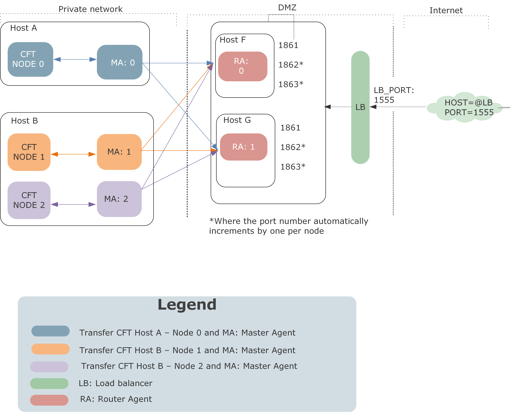

{
    "title": "Secure Relay with a multi-node architecture",
    "linkTitle": "Secure Relay with a multi-node architecture",
    "weight": "260"
}You can install Transfer CFT in an active/active architecture where you add multiple SecureRelay Router Agents behind a load balancer. The architecture could resemble the diagrams in the [Example architectures](#examples) section of this page.

This page describes how to configure Transfer CFT in a multi-node architecture to use Secure Relays:

-   Install Transfer CFT in a multi-node, multi-host architecture
-   Install 2 or more SecureRelay Router Agents (use the same CA and USER certificate as the Master Agent)
-   Enable Secure Relay and configure Java
-   Set the listening ports
-   Configure additional Transfer CFT objects
    -   Network object CFTNET
    -   Protocol object CFTPROT
    -   Partner object CFTPART and CFTTCP
-   Install and configure a load balancer (to use for incoming connections)
-   Example architectures schema

## Prerequisites

Follow the server-side load balancer instructions to install and configure the load balancer.

## Secure Relay Router Agent installation

Follow the installation instructions provided in the [Secure Relay RA Installation Guide](https://docs.axway.com/bundle/SecureRelay_271_InstallationGuide_allOS_en_PDF/resource/SecureRelayRA_InstallationGuide_allOS_en_PDF.pdf). During installation, it is essential that you configure the Router Agent CA and user certificate as follows to enable secure communication between the Master Agent and Router Agent:

-   &lt;CACertificate>CA\_for\_RA.der&lt;/CACertificate>
-   &lt;UserCertificate>USER\_for\_RA.p12&lt;/UserCertificate>

You need these values when you configure the Master Agent in the Transfer CFT configuration, where the user certificate that you use must be signed by CA\_for\_RA. You should use the same CA and USER certificate as for the Master Agent.

## Configure the Router Agents in Transfer CFT

After completing installation, configure the Router Agents in the Transfer CFT configuration.

1.  Set the value for the number of Router Agents using the `secure_relay.ra` parameter. Transfer CFT generates a set of `secure_relay.ra.n.*` parameters, where the number, *n*, corresponds to the number of Router Agents you defined in this parameter.
2.  You can use the default values for most fields, but you must customize the` secure_relay.ra.0.dmz` parameter. This value must be unique; for example, you can increment the DMZ0 value by one for each Router Agent so that the  second Router Agent has the value` secure_relay.ra.0.dmz = DMZ1`.
3.  Configure the host address for each Secure Relay host using secure\_relay.ra.0.host.

Example of two Router Agent definitions

<table data-cellspacing="0">
<tbody>
<tr class="odd">
<td>
secure_relay.ra = 2


 


secure_relay.ra.0.enable = yes


secure_relay.ra.0.dmz = DMZ0


secure_relay.ra.0.host = @hostF


secure_relay.ra.0.admin_port = 6810


secure_relay.ra.0.comm_port = 6811


secure_relay.ra.0.nb_data_connections = 5


secure_relay.ra.0.data_channel_ciphering = No


secure_relay.ra.0.outcall_network_interface =


 


secure_relay.ra.1.enable = Yes


secure_relay.ra.1.dmz = DMZ1


secure_relay.ra.1.host = @hostG


secure_relay.ra.1.admin_port = 6810


secure_relay.ra.1.comm_port = 6811


secure_relay.ra.1.nb_data_connections = 5


secure_relay.ra.1.data_channel_ciphering = No


secure_relay.ra.1.outcall_network_interface =
</td>
</tr>
</tbody>
</table>

## Configure the Master Agent in Transfer CFT

Configure the following UCONF parameters to enable the Master Agent communication with the Router Agent:

-   secure\_relay.ma.ca\_cert\_fname = &lt;must be the same as the CA\_for\_RA.der value>
-   secure\_relay.ma.cert\_fname = &lt;must be a P12 user certificate that is signed by the CA\_for\_RA.der>
-   secure\_relay.ma.cert\_password = &lt;user certificate password>

## Enable Secure Relay and configure the Java

In Transfer CFT from the CFTUTIL prompt, perform the following commands:

1.  Enable Secure Relay:  
    <table data-cellspacing="0">
    <tbody>
    <tr class="odd">
    <td>UCONFSET id=secure_relay.enable ,value=yes</td>
    </tr>
    </tbody>
    </table>

2.  Set the full path to Java executable, for example:  

3.  <table data-cellspacing="0">
    <tbody>
    <tr class="odd">
    <td>UCONFSET id=cft.jre.java_binary_path ,value=/bin/java</td>
    </tr>
    </tbody>
    </table>

## Set the listening ports

If you need to set listening ports, for example if you are using a firewall, proceed as follows:

1.  To define the Transfer CFT internal listening points for inter-node communication, select a port-range using the UCONF `cft.multi_node.listen_port_range` parameter. For example:  
    <table data-cellspacing="0">
    <tbody>
    <tr class="odd">
    <td>
UCONFSET id=cft.multi_node.listen_port_range,value='33000-33100'
</td>
    </tr>
    </tbody>
    </table>
2.  Define the protocol listening ports for Secure Relay, which correspond to the SAP values in the CFTPROT object. For each node this value  increments by one port number. Therefore, when configuring the CFTPROT object ensure that there is no  listening port overlap.

Example

For example, if you set the SAP=1761 when you have 4 nodes, Secure Relay opens the ports 1761, 1762, 1763 and 1764.

<table data-cellspacing="0">
<tbody>
<tr class="odd">
<td>
CFTPROT ID=PROT0,SAP=1761,...


CFTPROT ID=PROT1,SAP=1764,...
</td>
</tr>
</tbody>
</table>

In the scenario above if 4 nodes are configured in Transfer CFT multi-node, then Secure relay will open the listening ports 1761, 1762,1763, 1764 causing an issue for the second defined protocol, PROT1, as it has a SAP=1764.

Additionally, for each node the comm\_port also increments. That is, the `secure_relay.ra.N.comm_port` parameter, where N is an index.

-   N = 0: first RA
-   N =1: second RA
-   N = 2: third RA

However, when you define the secure\_relay.ra.N.admin\_port value, where N is an index, the value does not increment according to the number of nodes.

Example

If a multi-node Transfer CFT has 4 nodes and the setting `secure_relay.ra.N.comm_port= 6811`, Transfer CFT opens the ports 6811, 6812, 6813, and 6814.

## Define the environment for SecureRelay

### Create a CFTNET object

1.  Create a CFTNET object where:
    -   TYPE = TCP
    -   PROTOCOL = SR
2.  Define the RECALLHOST, HOST, and SSLTERM parameters.
    -   RECALLHOST (mandatory): The host address on which the Master Agent calls Transfer CFT when Secure Relay receives an incoming call. If Transfer CFT and the Master Agent run of the same host, use the loopback network interface (for example, 127.0.0.1) instead of the public network interface.
    -   HOST: Designates the network interface that is used on the Router Agent side. We recommend setting this to INADDR\_ANY.
    -   SSLTERM: Set this Boolean to YES to enable SSL termination.
3.  If there are existing CFTNET object(s), the class parameter must be different.

Example

As no connection dispatcher is used with Secure Relay, the SAP configured in the CFTPROT for SecureRelay is also incremented by the node number.

<table data-cellspacing="0">
<tbody>
<tr class="odd">
<td>
CFTNET ID = NETSR,


TYPE = TCP,


CALL = INOUT,


CALL = 'INOUT',


MAXCNX = '1000',


ORIGIN = 'CFTUTIL',


CLASS = '2',


HOST = 'INADDR_ANY',


SRCPORTS = ( '5000-65535'),


PORT = '0',


PROTOCOL = 'SR',


RECALLHOST = '127.0.0.1',


SSLTERM = 'NO',


MODE = 'REPLACE'
</td>
</tr>
</tbody>
</table>

### Create a CFTPROT object

This section describes the CFTPROT object, and how various parameters are related to enabling secure data transmission using Secure Relay.

-   CFTPROT is related to the CFTNET object through the NET parameter.
-   The SAP parameter is the listening port that is used on the RA side (using the CFTNET HOST parameter as the network interface).  
    This value automatically increments by one per node, where the range is &lt;number of nodes>-1. Therefore, be certain that you do not use the ports in this range for another protocol.

Example

This example uses a CFTNET object called NETXSR, and PROTXSR is bound to port 1861 for node 0, and port 1862 for node 1.

<table data-cellspacing="0">
<tbody>
<tr class="odd">
<td>
CFTPROT ID = 'PROTXSR'


NET = 'NETXSR',


SAP = '1861', &lt;Transfer CFT increments this for each node, be sure to check for port conflicts&gt;


SRIN = 'BOTH',


SROUT = 'BOTH',


TYPE = 'PESIT',


....
</td>
</tr>
</tbody>
</table>

### Create CFTPART and CFTTCP objects

When a partner object refers to a CFTPROT object and a CFTNET object that use Secure Relay, it uses Secure Relay for both incoming and outgoing connections.

So to complete the configuration, create a CFTPART and a CFTTCP. In this way, the CFTPART refers to the CFTPROT object, and that in turn refers to a CFTNET, which points to Secure Relay.

Example

This is an example of the CFTPART and CFTTCP object configuration.

<table data-cellspacing="0">
<tbody>
<tr class="odd">
<td>
CFTPART id = PARIS,


 prot = PROTXSR,


 sap = &lt;remote_partner_sap&gt;,


 nspart = NPARIS,


  nrpart = NPHOENIX,


  mode = replace


 


CFTTCP id = PARIS,


 class = 2, /* this must match and be the same class as the one used in the CFTNET (SecureRelay)*/


 host = &lt;remote_partner_host_address&gt;,


 mode = replace
</td>
</tr>
</tbody>
</table>

### Indicate a specific SecureRelay to use

If you would like to use a specific SecureRelay with a given partner, set the following parameter in the CFTPART:

<table data-cellspacing="0">
<tbody>
<tr class="odd">
<td>SRDMZ = &lt;UCONF secure_relay.ra.<em>n</em>.dmz value, where n is the number that corresponds to the SecureRelay to use&gt;</td>
</tr>
</tbody>
</table>

## Configure the load balancer

1.  Set the listening port, 1555 for our example, for the load balancer (LB).
2.  Set the back-end server address and port for each host (hostF and hostG).

In our example, we have load balancing with 2 Router Agents, 2 hosts, and 2 Transfer CFT nodes. You can see the port numbers increment by one for the second node (as many entries as number of RA x number of nodes).

listen cft LB:1555

## Example architectures

The following diagrams are examples of high availability with multiple Router Agents.




