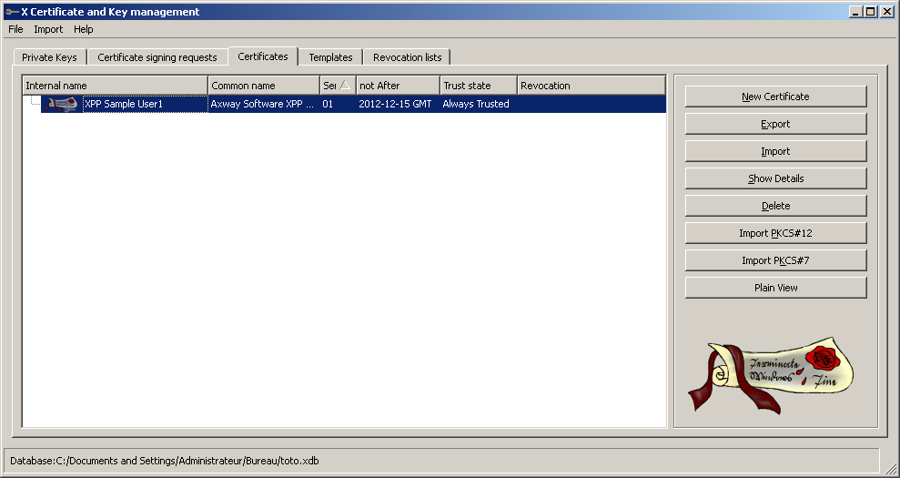

{
    "title": "Generate a certificate",
    "linkTitle": "Generate a certificate",
    "weight": "250"
}## How to generate a certificate with XCA

To generate certificates, for example using the XCA utility (X Certificate and Key management), perform the following steps.

1.  Create a New database.

    -   Enter a password to protect the database that contains your certificate.

    

2.  Select the Certificates tab.
    -   Select: New Certificate

3.  Select the Source tab.
    -   In the Signature algorithm field, select MD5.

4.  Select the Subject tab.
    -   Complete the fields for your certificate.

    <!-- -->

    -   Click Generate a new key.
        -   Enter a key name
        -   Select 1024 bit as the key size
        -   Select Keytype
        -   Click Create

5.  In the Extensions tab:

    -   In "Type": select End Entity

    <!-- -->

    -   Select "Subject Key Identifier"

    <!-- -->

    -   Select the expiry date of your certificates

    <!-- -->

    -   Inform: "Subject alternative Name"

    

6.  In the Key Usage tab:
    -   In "Key Usage", select :
        -   Digital Signature

        <!-- -->

        -   Non Repudiation

        <!-- -->

        -   Key Enciphering

        <!-- -->

        -   Data Enciphering

    <!-- -->

    -   In "Extended Key usage", select:
        -   E-mail Protection

7.  Click  OK to generate the certificate.

## Export the certificate that has been created.

1.  In Certificates tab, select the certificate you want to export.
2.  Select Export.
    -   In Export Format: choose "PEM" for export PUBLIC CERTIFICATE.

    <!-- -->

    -   Click OK .

    <!-- -->

    -   Select Export.
3.  Select the certificate you want to export (filename).
    -   In Export Format: choose "PKCS #12" for export PRIVATE CERTIFICATE
    -   Click OK .
4.  Enter a password to protect your private certificates.

## How to generate a certificate with OpenSSL

To create a self signed certificate:

<table cellspacing="0">
   <col/>
   <tbody>
      <tr>
         <td>
            
openssl req -new -newkey rsa:4096 -x509 -sha256 -days 365 -nodes -out XPP_Sample_User1.pem -keyout MyKey.key

         </td>
      </tr>
   </tbody>
</table>

Export the certificate in PKCS12 format:

<table cellspacing="0">
   <col/>
   <tbody>
      <tr>
         <td>
            
openssl pkcs12 -export -out XPP_Sample_User1.p12 -inkey MyKey.key -in XPP_Sample_User1.pem

         </td>
      </tr>
   </tbody>
</table>

## Use the CFTTF utility to generate your passphrase

Use the CFTTF utility, to perform the following task.

Enter: CFTTF –pw \[XXXX\]

Where: XXXX --> is the same password as your private "PKCS #12" certificates (see above steps).

Example

CFTTF –pw Axway

OUTPUT: m8ZWaOMdkj70UzJZD+wv8gSsi1ycSTEJ5c0H6SH6dLE=

## Update the entity.xml file

In  the delivered entity.xml file, update the location in the user1\_pub entity. For example, if XPP\_Sample\_User1.pem is in the /home/cft/runtime/conf/tf/certs/pub folder, then:

<table cellspacing="0">
   <col/>
   <tbody>
      <tr>
         <td>
            
&lt;pkiEntity id="user1_pub"&gt;

            
&lt;certificate&gt;

            
&lt;format&gt;PEM&lt;/format&gt;

            
&lt;location&gt;/home/cft/runtime/conf/tf/certs/priv/XPP_Sample_User1.p12&lt;/location&gt;

            
&lt;/certificate&gt;

            
&lt;/pkiEntity&gt;

         </td>
      </tr>
   </tbody>
</table>

In  the delivered entity.xml file, update the location in the user1\_pub entity. For example, if XPP\_Sample\_User1.p12 is in the /home/cft/runtime/conf/tf/certs/priv folder and the password=Axway, then:

<table cellspacing="0">
   <col/>
   <tbody>
      <tr>
         <td>
            
&lt;pkiEntity id="user1_priv"&gt;

            
&lt;certificate&gt;

            
&lt;format&gt;PKCS#12&lt;/format&gt;

            
&lt;location&gt;/home/cft/runtime/conf/tf/certs/privXPP_Sample_User1.p12&lt;/location&gt;

            
&lt;passPhrase&gt;m8ZWaOMdkj70UzJZD+wv8gSsi1ycSTEJ5c0H6SH6dLE=&lt;/passPhrase&gt;

            
&lt;/certificate&gt;

            
&lt;/pkiEntity&gt;

         </td>
      </tr>
   </tbody>
</table>

## Update your Trusted File encoding/decoding procedures

You must change the passphrase that corresponds to the private key passphrase generated by CFTTF command ( CFTTF -pw xxxx) in either the conf/tf/decfile\_cms.xml or conf/tf/encfile\_cms.xml file.

In the examples on this page, we changed the public and private keys for the user1\_pub and `user1_priv_entity` (the PKCS12 certificate and key, using the password Axway), where the corresponding example passphrase is `m8ZWaOMdkj70UzJZD+wv8gSsi1ycSTEJ5c0H6SH6dLE=.`

As the private key `user1_priv` is referenced in` enfile_cms.xms` file , you must change the passphrase in the &lt;signature> section as follows:

<table cellspacing="0">
   <col/>
   <tbody>
      <tr>
         <td>
            
&lt;signature requested="yes"&gt;

            
&lt;signer&gt;

            
&lt;signatureAlgorithm&gt;sha1WithRsaEncryption&lt;/signatureAlgorithm&gt;

            
&lt;pkiEntity id="user1_priv" password="m8ZWaOMdkj70UzJZD+wv8gSsi1ycSTEJ5c0H6SH6dLE="&gt;&lt;/pkiEntity&gt;

            
&lt;/signer&gt;

            
&lt;/signature&gt;

         </td>
      </tr>
   </tbody>
</table>
